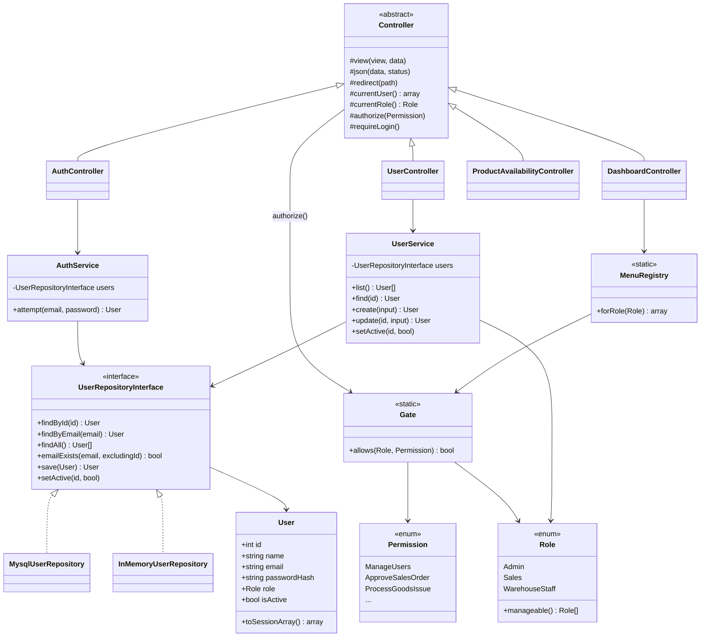
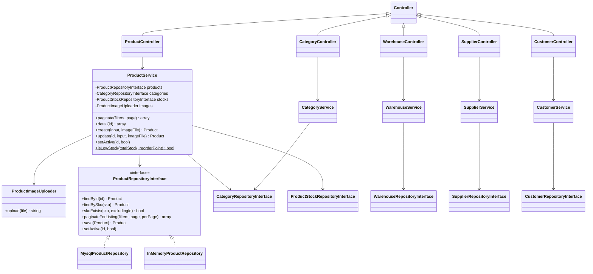

# Class Diagram - As-Built

**Partial.** Covers what exists today (auth, RBAC, user management, product
availability, and master data: Category/Warehouse/Supplier/Customer/Product).
Regenerate/extend once PO/SO/dashboard/report Services are built, then finish
the "what changed vs. initial" note below.

## Master data (PRD-01, WH-01, FIND-01)

Category/Warehouse/Supplier/Customer each follow the exact same
Interface + Mysql implementation shape as `ProductRepositoryInterface`
above (omitted here for brevity - see `app/Repository/Contracts/` and
`app/Repository/Mysql/`). Only `ProductRepositoryInterface` also has an
`InMemory` fake, since it's the one exercised by `tests/Unit/ProductServiceTest.php`
(ARCH-01 requires this for at least one repository, not all of them).

## What changed vs. initial, and why
- The initial diagram only sketched `ProductAvailabilityService`. Building
  login required a parallel `User`/`UserRepositoryInterface` stack, which
  turned out to need its own authorization layer (`Role`, `Permission`,
  `Gate`, `MenuRegistry`) rather than being folded into `Controller` -
  splitting it out kept `Controller` a thin base class instead of growing
  business rules into it (see `docs/architecture/adr-0004-rbac-fixed-roles-vs-dynamic.md`).
- Error handling moved from ad-hoc `http_response_code()` calls inside each
  Controller action to three typed exceptions
  (`UnauthenticatedException`/`AuthorizationException`/`NotFoundException`)
  caught once in `public/index.php` - not in the initial sketch, added so
  ERR-01's "no stack trace leaks" rule has exactly one enforcement point.
- `ProductService` ended up depending on three repositories plus an uploader
  (Category for FK validation, ProductStock for the WH-01 detail view,
  ProductImageUploader for PRD-01's upload rule) - wider than a typical
  Service in this codebase. Considered splitting further, but the extra
  interfaces would only ever have one real caller each; kept as one Service
  with a 4-argument constructor rather than introducing seams nothing else
  uses yet.

## Still to add once built
PurchaseOrder/SalesOrder Services + status-transition rules, the
StockLedger writer, and the ARCH-02 concurrency mechanism.
