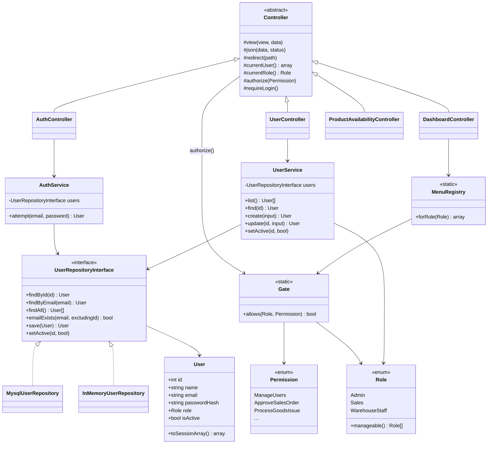
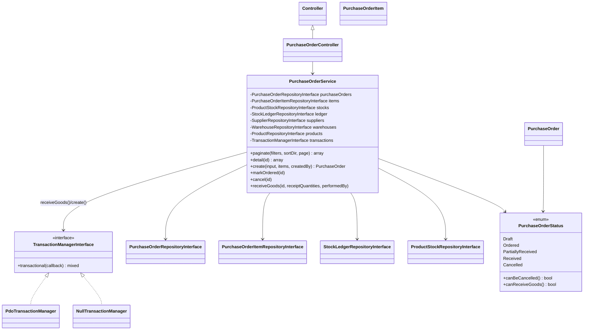
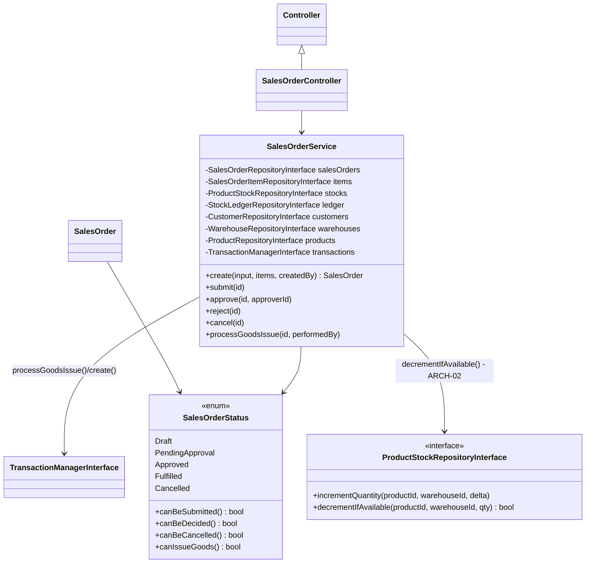
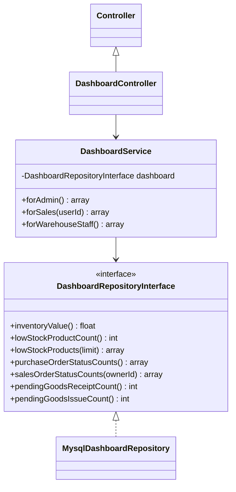
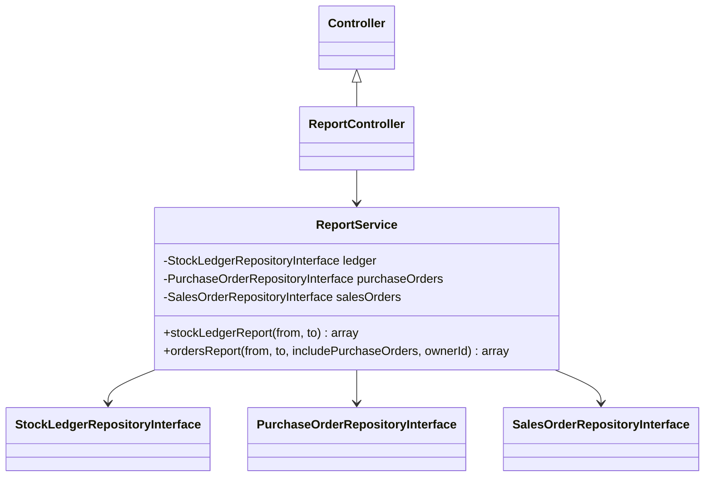

# Class Diagram - As-Built

**Partial.** Covers what exists today (auth, RBAC, user management, product
availability, and master data: Category/Warehouse/Supplier/Customer/Product).
Regenerate/extend once PO/SO/dashboard/report Services are built, then finish
the "what changed vs. initial" note below.

## Master data (PRD-01, WH-01, FIND-01)

Category/Warehouse/Supplier/Customer each follow the exact same
Interface + Mysql implementation shape as `ProductRepositoryInterface`
above (omitted here for brevity - see `app/Repository/Contracts/` and
`app/Repository/Mysql/`). Only `ProductRepositoryInterface` also has an
`InMemory` fake, since it's the one exercised by `tests/Unit/ProductServiceTest.php`
(ARCH-01 requires this for at least one repository, not all of them).

## Purchase Order & goods receipt (PO-01, ARCH-02)

`TransactionManagerInterface` is the key addition here: it's the seam that
lets `receiveGoods()` - which must run its multi-table write inside a real
`beginTransaction()/commit()/rollBack()` in production - be unit-tested
against `NullTransactionManager` + InMemory repositories with no MySQL at
all (`tests/Unit/PurchaseOrderServiceTest.php`). `PurchaseOrderRepository`,
`PurchaseOrderItemRepository`, `StockLedgerRepository`, `SupplierRepository`,
and `WarehouseRepository` all follow the same Interface + Mysql (+ InMemory
for the ones needed by that test) shape already established for Product/User.

## Sales Order & goods issue (SO-01, ARCH-02)

`SalesOrderService::approve()` is where the brief's SoD rule actually lives
in code: it rejects if `$so->createdBy === $approverId`, regardless of role
- the same guarantee `chk_so_approver_not_creator` enforces at the DB layer,
checked here first for a clean error message instead of a raw SQL failure.

`processGoodsIssue()` is ARCH-02's real scenario (unlike PO's goods receipt,
which never risks a negative quantity): it loops the order's items inside
one `transactions->transactional()` call, and the moment
`ProductStockRepositoryInterface::decrementIfAvailable()` returns `false` for
any item, it throws - rolling back every decrement already made earlier in
that same loop, leaving the Sales Order `Approved` (not half-`Fulfilled`).
See `docs/architecture/adr-0002-concurrency-safe-stock.md` for why
`decrementIfAvailable()`'s single conditional `UPDATE` is the chosen
mechanism, and `tests/Unit/SalesOrderServiceTest.php` for the controlled,
sequential proof the brief asks for (real parallel threads not required).

## What changed vs. initial, and why
- The initial diagram only sketched `ProductAvailabilityService`. Building
  login required a parallel `User`/`UserRepositoryInterface` stack, which
  turned out to need its own authorization layer (`Role`, `Permission`,
  `Gate`, `MenuRegistry`) rather than being folded into `Controller` -
  splitting it out kept `Controller` a thin base class instead of growing
  business rules into it (see `docs/architecture/adr-0004-rbac-fixed-roles-vs-dynamic.md`).
- Error handling moved from ad-hoc `http_response_code()` calls inside each
  Controller action to three typed exceptions
  (`UnauthenticatedException`/`AuthorizationException`/`NotFoundException`)
  caught once in `public/index.php` - not in the initial sketch, added so
  ERR-01's "no stack trace leaks" rule has exactly one enforcement point.
- `ProductService` ended up depending on three repositories plus an uploader
  (Category for FK validation, ProductStock for the WH-01 detail view,
  ProductImageUploader for PRD-01's upload rule) - wider than a typical
  Service in this codebase. Considered splitting further, but the extra
  interfaces would only ever have one real caller each; kept as one Service
  with a 4-argument constructor rather than introducing seams nothing else
  uses yet.
- `Controller::view()`'s render logic (extract data, buffer the view,
  wrap it in the layout) moved into a new `App\Core\View::render()`, called
  both by `Controller::view()` and directly by `public/index.php`'s error
  handler and `Router`'s 404 fallback. Found while doing the UI pass: those
  two call sites were `require`-ing error view fragments directly, bypassing
  the layout entirely - so 403/404/500 pages had no `<head>`/CSS/nav at all.
  Centralizing the render call fixed that in one place instead of three.

## Dashboard (DASH-01)

`DashboardRepositoryInterface` has no `InMemory` fake (pure aggregation SQL,
nothing to unit-test without a database - see `docs/quality/tech-debt.md`
#17) and is written so REPORT-01's CSV export can reuse the same queries,
per the brief's "dihasilkan dari query agregasi/rekap yang sama dengan
dashboard".

## Reports (REPORT-01)

Deliberately thin: `ReportService` adds no new repositories of its own,
just composes `findForReport()`/`findByDateRange()` methods added to the
*existing* PO/SO/StockLedger repositories - the same ones `DashboardService`
reads from - rather than a separate reporting data path. No `InMemory` fake
here either, same reasoning as `DashboardRepositoryInterface` (see
`docs/quality/tech-debt.md` #18).

## Still to add once built
This is now every WAJIB functional slice from brief §2. What's left is
evidence, not features: TEST-02 integration tests exercising
`decrementIfAvailable()`, `MysqlDashboardRepository`, and the report
endpoints against real MySQL (currently unit-tested against InMemory fakes /
hand-reviewed only - see `docs/quality/tech-debt.md` #16/#17/#18), the
refactor log/tech-debt-register writeup (DESIGN-03), and an actual
`composer analyse` run (TEST-03) - none of which changes the class diagram
itself.
