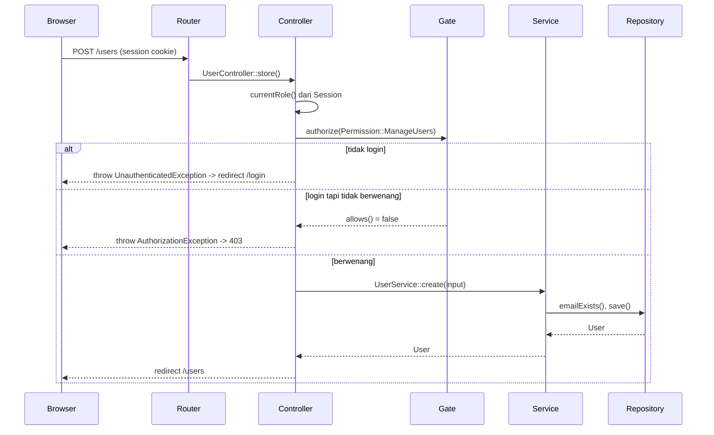

# Arsitektur Autentikasi, Role & Akses Menu

Dokumen ini menjelaskan bagaimana login/session, data User, role, dan akses
menu saling terkait di Ordina - serta langkah konkret untuk menambah role
baru atau menu/akses baru. Ditulis untuk developer (paham alurnya saat
mengubah kode) maupun sebagai referensi pengguna aplikasi (paham kenapa
menu tertentu tidak muncul untuk role tertentu).

Terkait: `ADR-0001` (layered architecture), brief §1.2 (tabel SoD), §2.1
(AUTH-01/USR-01).

## 1. Properti User dan kegunaannya

Tabel `users` (`database/schema-and-seed.sql`) + `App\Entity\User`:

| Properti | Tipe | Kegunaan |
|----------|------|----------|
| `id` | int | Identitas unik, dipakai sebagai `created_by`/`approved_by`/`performed_by` di PO/SO/StockLedger |
| `name` | string | Ditampilkan di UI (sapaan dashboard, kolom "dibuat oleh") |
| `email` | string, unik | Identitas login; unik dicek di `UserService::validate()` |
| `password_hash` | string | Hasil `password_hash()`, diverifikasi via `password_verify()` (AUTH-01) - **tidak pernah** dikirim ke session atau ke client |
| `role` | enum | Salah satu dari 3 nilai tetap - lihat §2 |
| `is_active` | bool | Nonaktifkan tanpa hapus (soft-deactivate); user nonaktif ditolak saat login walau password benar |
| `created_at` / `updated_at` | timestamp | Audit dasar |

Yang disimpan ke `$_SESSION['user']` (`User::toSessionArray()`) sengaja
dibatasi ke `id`, `name`, `email`, `role` - tidak ada `password_hash`.

## 2. Role - tiga nilai tetap, bukan tabel dinamis

```php
// app/Domain/Role.php
enum Role: string
{
    case Admin = 'Admin';
    case Sales = 'Sales';
    case WarehouseStaff = 'WarehouseStaff';
}
```

Ini **sengaja** berupa PHP enum yang mencerminkan `ENUM('Admin','Sales',
'WarehouseStaff')` di kolom `users.role`, bukan tabel `roles` yang bisa
diisi bebas oleh Admin lewat UI. Alasannya:

- Brief §1.3 menyatakan role adalah "Nilai tetap" dan §2.1 (USR-01) hanya
  mengizinkan tiga role ini, tanpa public registration atau UI "buat role
  baru".
- Seluruh keputusan segregation-of-duties (SO-01: Sales tidak bisa approve
  order sendiri) ditulis sebagai kode/test terhadap tiga role yang diketahui
  (lihat `tests/Unit/GateTest.php`). Role kelima yang dibuat on-the-fly lewat
  UI tidak akan punya aturan otorisasi yang jelas sampai kode diubah - jadi
  "role dinamis" akan memberi rasa aman yang palsu.
- Ini juga alasan kenapa `UserService`/`UserController` hanya mengelola
  `Role::manageable()` (Sales, WarehouseStaff) - akun Admin dibuat lewat seed,
  bukan dari layar Manajemen User.

## 3. Permission - satu per aksi yang dilindungi

`app/Core/Authorization/Permission.php` mendaftar satu enum case per baris
di tabel §1.2 brief, misalnya `ManageUsers`, `ApproveSalesOrder`,
`ProcessGoodsIssue`. Ini level yang lebih halus daripada Role: satu halaman
bisa punya beberapa Permission berbeda tergantung aksi (mis. halaman Sales
Order butuh `CreateSalesOrder` untuk Sales, `ApproveSalesOrder` untuk Admin).

## 4. Gate - pemetaan Role -> Permission (satu sumber kebenaran)

`app/Core/Authorization/Gate::ROLE_PERMISSIONS` adalah **satu-satunya**
tempat yang memutuskan permission apa saja yang dimiliki tiap role. Baik
Controller (enforcement sesungguhnya) maupun MenuRegistry (tampilan nav)
bertanya ke sini - keduanya tidak akan pernah berbeda pendapat soal siapa
boleh apa.

```php
Gate::allows(Role::Sales, Permission::ApproveSalesOrder); // false
Gate::allows(Role::Admin, Permission::ApproveSalesOrder); // true
```

## 5. Menu Registry - navigasi mengikuti permission

`config/menus.php` mendaftar setiap item menu + permission yang dibutuhkan
(`null` = selalu tampil ke user yang login, satu `Permission`, atau daftar
`Permission` dengan logika OR). `App\Core\Authorization\MenuRegistry::forRole()`
memfilternya untuk role yang sedang login, dipakai oleh
`DashboardController` untuk merender nav.

**Penting**: menu yang disembunyikan hanyalah kenyamanan tampilan. Keamanan
sesungguhnya ada di langkah berikutnya.

## 6. Alur request end-to-end



`Controller::authorize()` men-throw exception (tidak langsung render) -
ditangkap satu tempat di `public/index.php`, sehingga 401/403/404/500 selalu
konsisten dan tidak ada stack trace yang bocor (ERR-01). Ada dua sumber 403
yang sengaja dipisah: `AuthorizationException` (role tidak punya Permission
sama sekali - dari `Gate`) dan `App\Service\Exception\ForbiddenOperationException`
(role punya Permission tapi aturan bisnis tetap menolak, mis. `UserService`
menolak siapa pun mengelola akun Admin lewat layar Manajemen User). Keduanya
dirender sebagai 403 yang sama di `public/index.php`.

## 7. Cara menambah role baru

Role baru **mengubah kontrak data** (kolom `users.role` adalah ENUM), jadi
ini pekerjaan developer, bukan tindakan Admin lewat UI. Langkah:

1. **Migrasi database**: `ALTER TABLE users MODIFY role ENUM('Admin','Sales','WarehouseStaff','NamaRoleBaru') NOT NULL;`
   (tambahkan ke `database/schema-and-seed.sql` atau file migration baru).
2. **`app/Domain/Role.php`**: tambah `case NamaRoleBaru = 'NamaRoleBaru';`,
   tambahkan label di `label()`, dan putuskan apakah masuk
   `manageable()` (bisa dibuat lewat layar Manajemen User) atau tidak.
3. **`app/Core/Authorization/Gate.php`**: tambah entri baru di
   `ROLE_PERMISSIONS` berisi daftar `Permission` yang dimiliki role ini.
   Ini satu-satunya tempat yang menentukan hak akses aktualnya.
4. **`config/menus.php`**: kalau role ini perlu melihat menu yang sudah ada
   dengan permission berbeda, tambahkan permission role baru ke daftar
   `permission` menu terkait (array OR).
5. **Tests**: tambah kasus di `tests/Unit/GateTest.php` yang menegaskan apa
   yang BOLEH dan TIDAK BOLEH dilakukan role baru - ini dokumentasi hidup
   yang gagal duluan kalau ada regresi.
6. **`docs/architecture/adr-*.md`**: catat ADR singkat kenapa role ini
   dibutuhkan (brief §2 DESIGN-02 meminta keputusan nyata didokumentasikan).

## 8. Cara menambah akses menu / halaman baru

Untuk fitur baru yang perlu muncul di nav dan dilindungi di server:

1. **Tentukan Permission**: kalau aksinya belum ada di
   `app/Core/Authorization/Permission.php`, tambah satu case baru
   (mis. `Permission::ExportInventoryValuation`).
2. **Perbarui `Gate::ROLE_PERMISSIONS`**: masukkan Permission itu ke role
   mana saja yang boleh mengaksesnya.
3. **Tambah Controller + route** di `app/routes.php`, lalu panggil
   `$this->authorize(Permission::ExportInventoryValuation);` di baris
   pertama method Controller yang relevan - ini enforcement sesungguhnya.
   Kalau halaman yang sama dipakai beberapa role untuk alasan berbeda
   (contoh nyata: `/products` - Admin mengelola, Sales melihat katalog,
   Warehouse Staff mengecek stok), pakai
   `$this->authorizeAny(Permission::A, Permission::B, ...)` - lolos kalau
   role punya SALAH SATU permission tersebut. Lihat `ProductController::index()`.
4. **Tambah entri di `config/menus.php`** (`key`, `label`, `route`,
   `permission`) supaya muncul di nav untuk role yang berwenang.
5. **View**: buat file di `views/...` sesuai path yang dipanggil
   `Controller::view()`.

Urutan di atas sengaja meletakkan Permission+Gate (keamanan) sebelum menu
(tampilan) - kalau langkah 4 lupa dikerjakan, halaman tetap aman (hanya
tidak muncul di nav); kalau langkah 2-3 lupa, itu bug otorisasi yang harus
ketahuan dari test, bukan dari menu yang "kebetulan" tidak tampil.

## 9. Yang TIDAK dibangun (dan kenapa)

Tidak ada tabel `roles`/`permissions`/`role_permissions` di database, dan
tidak ada layar "buat role" atau "atur menu" untuk Admin. Brief secara
eksplisit hanya meminta tiga role tetap dan memperingatkan bahwa lapisan
tambahan yang tidak menyelesaikan masalah nyata dinilai negatif (over-
engineering). Role/permission dinamis lewat database akan menambah
kerumitan signifikan (perlu UI admin, migrasi data, validasi kombinasi
permission yang valid) untuk kebutuhan yang oleh brief sendiri sudah
dinyatakan tetap - sehingga pendekatan berbasis enum + kode ini yang dipilih
dan didokumentasikan di sini agar semua orang tahu di mana mengubahnya saat
kebutuhan benar-benar berubah.
