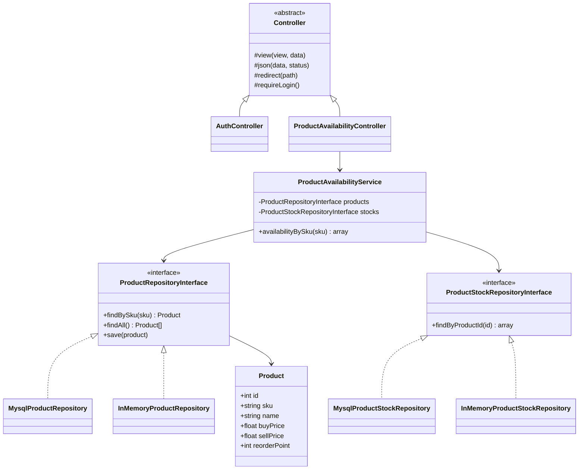

# Class Diagram - Initial (before coding)

Per DESIGN-01, this snapshot must predate implementation. Compare against
`docs/architecture/class-diagram-as-built.md` at the end and note what changed.

## Planned but not yet modelled here
PurchaseOrder/SalesOrder services and their status-transition rules,
StockLedger writer, and the concurrency-safe stock-mutation mechanism
(ARCH-02) - to be added as those slices are built, then reconciled in the
as-built diagram.
