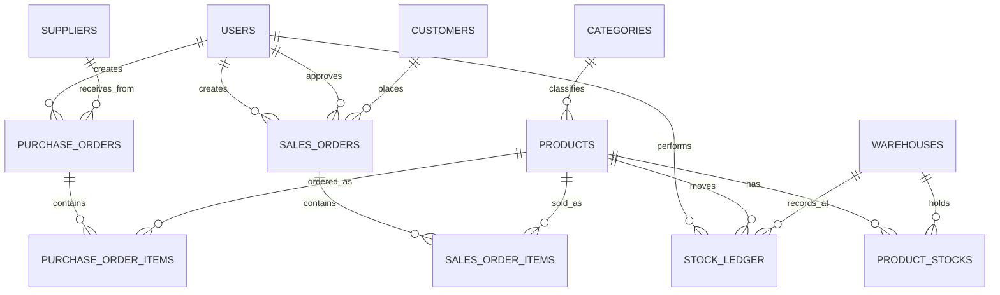

# ERD (Initial)

Matches `database/schema-and-seed.sql`. Redraw with the diagram tool of your choice
(draw.io, dbdiagram.io, Mermaid) and export an image/PDF here once finalised -
this Mermaid block is a placeholder so the relationships are visible from day one.

